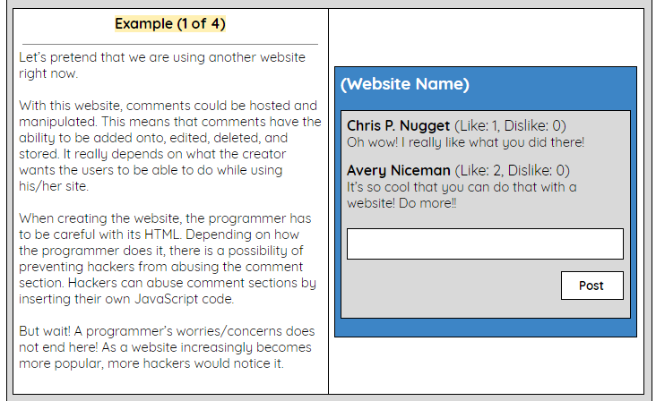

# Entry 7: Making a MVP 
With the time running out, there is no time to be second guessing myself. I have to crank out something for my MVP! Read on to know what I did to combat this major obstacle! 

## Before Starting a MVP 
While knowing that time is running out, Mr. Mueller suggested that I should stop learning other topics, which I did because I know how I am whenever I want to learn something. Then, I started the process of planning my MVP. Here are the first couple of questions that I asked myself: 

**1. What do I want to make?**  
* I would like to make something similar to Hacksplaining, where there is a simulation aspect. With the simulation, I would like to specifically showcase the four topics on Cross-site Scripting. 

**2. Should I work with someone?**  
* While I do feel like it is possible for me to work on it by myself, I cannot do so because it would take a very long time, which is something that I do not have right now. Plus, it would be better if someone else, who is learned about it recently, do it instead. 

Once I have decided to work with a partner, I remembered that Mr. Mueller suggested that I would work with my classmate Ricardo, who was dealing with ReactJS. To attempt to partner with Ricardo, I sent him an email with a summary of what I was learning and propose my MVP idea to him to see if he would be interested in doing the project with me. Luckily, he agreed to work with me. 

## Trouble Beginning MVP 

##### Where Should Our MVP Live In? 
After deciding to work together, I asked him where we should put our project. To be more specific, I asked him whether our MVP should be on a website or not because I thought that the location of our MVP is the foundation. We then both agreed that our MVP should be in a website. 

##### Starting Our Website 
It is established that we want our project to be in a website, okay, good. Next, we thought that should make a navigation bar (navbar) for our website. Ricardo started making the navbar through the usage of this website: [React-Bootstrap](https://react-bootstrap.github.io/components/navbar/). He tries making the second one shown in the reference website, which worked, but we wanted it to scroll to the section in which the user clicked. In other words, if a user clicked "Simulation" in the navbar, I want our website to scroll to that section. 

His attempts to make this idea come true did not work. However, I remembered that we did a class assignment with that feature before, it was the Earth website. I found it in my Cloud9 workspace and showed it to him. A thing that I learned from being his partner is that ReactJS is not exactly the same as JavaScript. Therefore, one may need to have a second look at the code.  

I remembered that one of my classmates, Cheyenne has been through this kind of obstacle before. In [Cheyenne's 6th entry](https://github.com/cheyennen0503/sass/blob/master/entries/entry06.md), she mentioned how she has made the mistake of spending a whole day on the navbar. By remembering my peer's mistake, I tried helping my partner by finding other templates that might be "easier". While Ricardo was doing the website's design and interaction parts, I was typing the website's content in a Google Doc to save time. In the document, I structure it so that all Ricardo has to do is copy and paste the texts that I typed. I have even made a visual for him to see.  

 

## Takeaways 
* **When time is running out, there is no time to be too indecisive.** 
    * This happened to me when I was deciding whether or not I should work with a partner. To be honest, I was indecisive for a bit because I was concerned about the other person, about whether I might be holding him back. Again, while knowing that time is running out, I have decided to just email him and ask. If he declines my offer, then it is okay. While I am waiting for his reply, I would start planning my MVP and so on. 
* **Do something else, while the problem is not solved yet.** 
    * I think that it is common for a person to be stuck in one, multiple, or even all of the sections of their projects. It depends on the person whether or not to stay in one section/task. However, the person would need to prioritize the tasks/sections, especially when time is running out. The key is to communication with yourself and your partner(s) (if you applicable). 

## Next Steps
While my partner is setting up the website, all I can do for now is ask every now and then if he needs help through the website, Slack. That is because the code for our MVP is in his computer and I am not familiar with ReactJS.   
